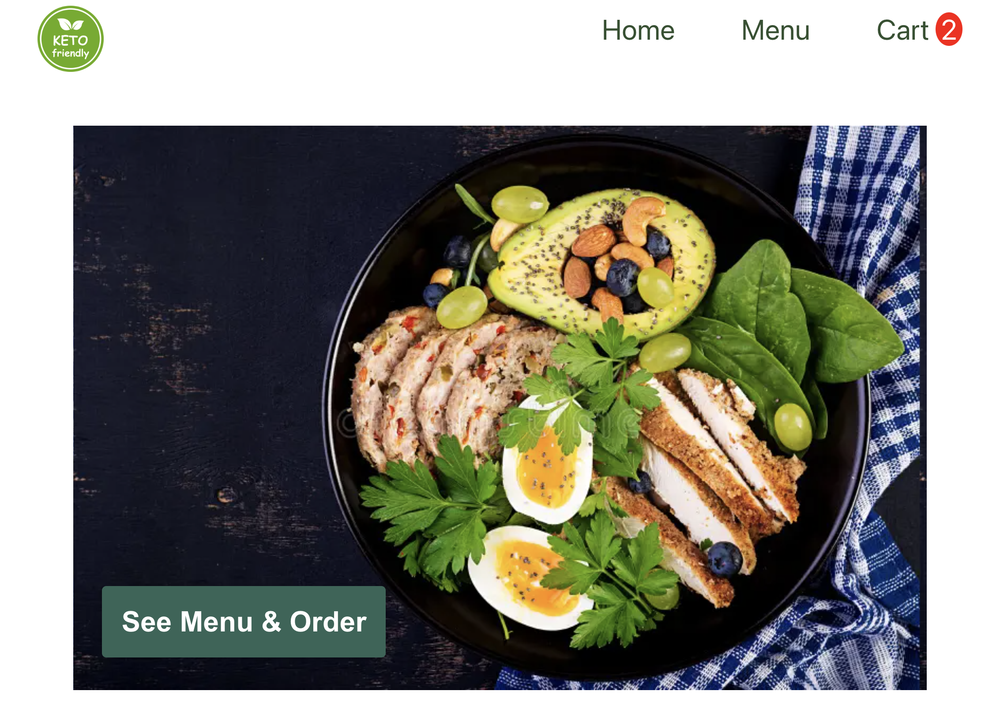
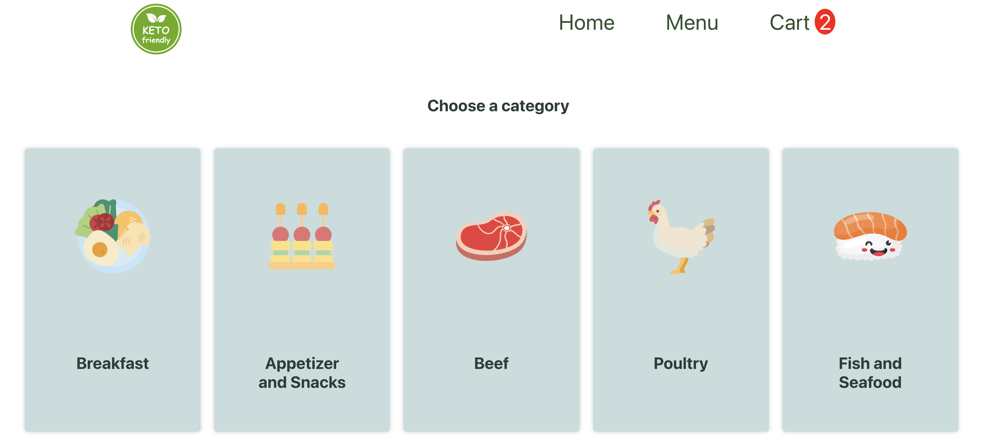
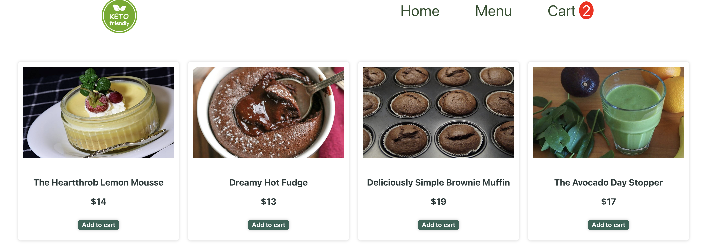

# [Keto Friendly Restaurant Live Link](https://ketowebreact.netlify.app)

# Keto Diet App

This application is a simple restaurant website for browsing keto diet meals, adding them to a cart, and managing the cart. The project is built with React, React Router, and utilizes a third-party API to fetch product data.

## Technologies Used

- **React**: A JavaScript library for building user interfaces.
- **React Router**: A library for handling routing in React applications.
- **CSS**: Used for styling the application.
- **Fetch API**: For making API calls to the keto diet products API.

## Approach Taken

1. **Project Structure**: The application is divided into several components and pages, organized as follows:

   - **Components**: Reusable pieces of UI (e.g., `Nav` for navigation).
   - **Pages**: Main views of the application (e.g., `Products`, `Main`, `Categories`, `Cart`).

2. **State Management**: The state is managed using React's `useState` hook. Key states include `selectedItems`, `total`, `count`, and `quantity`.

3. **API Integration**: The application fetches product data from an external API using the Fetch API and displays it on the `Products` page based on the category Id.

4. **Routing**: Routing is handled by React Router, allowing navigation between the main page, categories, product details, and the cart.

5. **Adding and Removing Items**: Items can be added to the cart from the `Products` page, and quantities can be adjusted in the cart. The total price and item count are dynamically updated.
